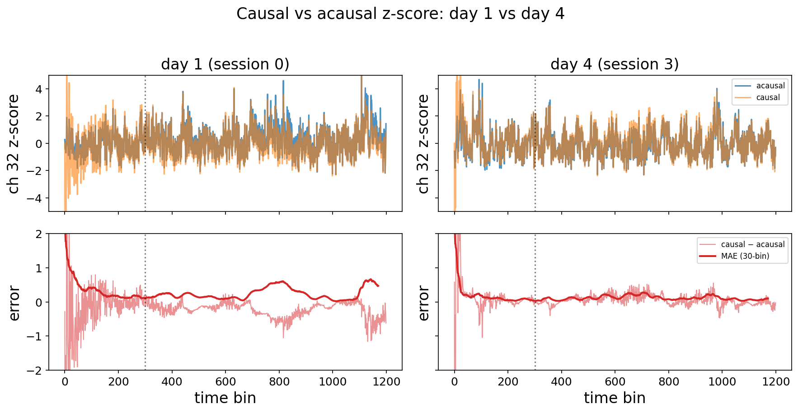
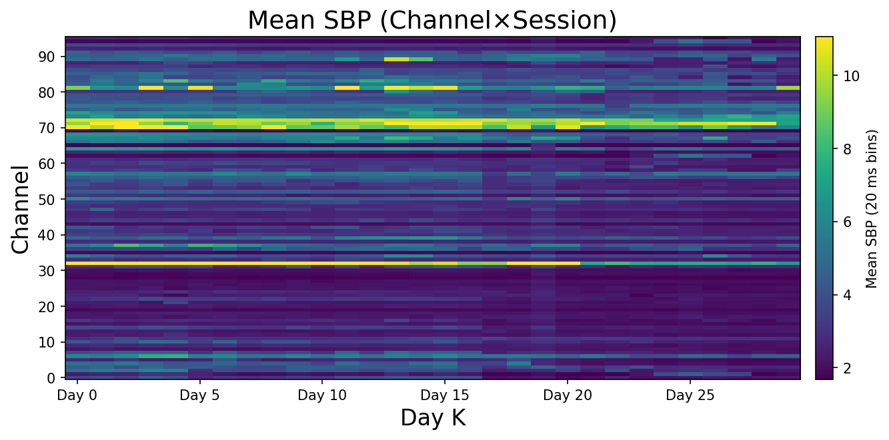
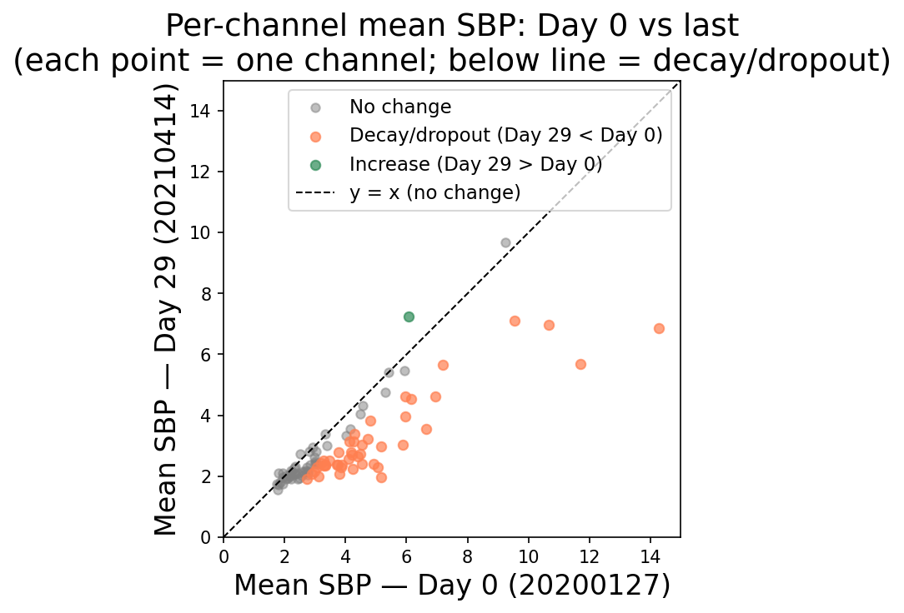

# ephys-signal

A Python analysis package for drift-robust feature engineering from chronic extracellular electrophysiology recordings.


> **Latest result:** Causal (online) normalization keeps cross-day decoder correlation comparable to — and sometimes higher than — acausal (offline) normalization.

## What this is

This project builds a signal processing and decoding pipeline on top of the [LINK dataset](https://dandiarchive.org/dandiset/001201) (DANDI:001201) — a 3.4-year NHP Utah-array recording with 96 channels across 312 sessions. The central question is how to engineer features from threshold-crossing rates (TCR) and spiking-band power (SBP) that remain stable for population decoding despite long-term electrode drift and channel dropout.

The pipeline follows a medallion architecture (Bronze → Silver → Gold):

- **Bronze** — raw NWB session loading
- **Silver** — filtering, artefact removal, spike detection
- **Gold** — drift-robust feature table (daily z-score normalization, population rate smoothing, channel health scoring), decoder training, and evaluation plots

## Results at a glance

### Long-term signal landscape

96-channel Utah-array SBP traces across the local subset of 30 LINK sessions reveal channel-specific dropout and slow drift.



### Decoder drift without correction

Raw features decay: day-0 vs. last-day cross-session decoder $R^2$ collapses as electrode drift and channel dropout accumulate.



### Causal streaming normalization

Causal (online-ready) normalization recovers cross-day stability and matches acausal (offline) performance on held-out sessions.


## Structure

```text
01_data/          NWB session files (not tracked — download from DANDI)
02_package/       neurosignal Python package
  src/neurosignal/
    io/           NWB loaders and session inspection
    silver/       filters, artefact detection, spike detection
    gold/         drift analysis, feature normalization, decoder training
    viz/          figure export utilities
03_notebooks/     Analysis notebooks (thin wrappers over the package)
04_output/        Generated figures and supporting outputs
```

## Setup

```bash
python -m venv venv
source venv/bin/activate
pip install -r requirements.txt
pip install -e 02_package/
```

Data download (requires [DANDI CLI](https://github.com/dandi/dandi-cli)):

```bash
dandi download DANDI:001201
```

## Notebooks

| Notebook | Description |
| --- | --- |
| `sbp-drift-discovery_v1.ipynb` | Channel dropout and TCR/SBP drift curves over 1242 days |
| `sbp-drift-fix_v1.ipynb` | Daily normalization and drift-corrected population rate |
| `sbp-mlp-decoder_v1.ipynb` | Cross-session MLP decoder using joint SBP + TCR features |
| `sbp-causal-streaming_v1.ipynb` | Causal (online) normalization for streaming cross-session decoding |

## Dataset

LINK dataset — Chowdhury et al., NHP motor cortex, dual 8×8 Utah arrays, 1242 days.
Available on DANDI Archive: [DANDI:001201](https://dandiarchive.org/dandiset/001201)
